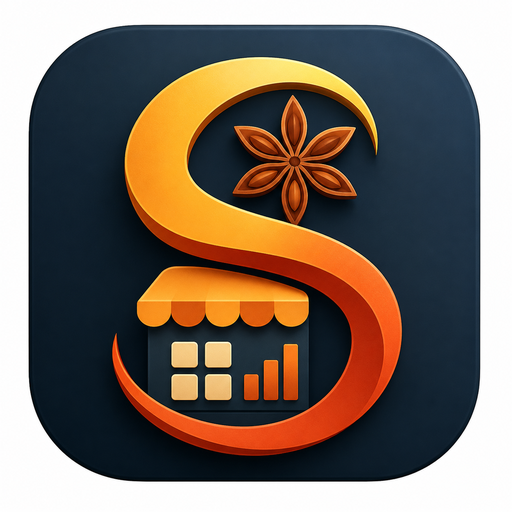

<p align="center">
  
</p>

<p align="center">
  <strong>Business management suite for bakeries, delis, and savoury shops. Built by Shahid Singh.</strong>
</p>

<p align="center">
  
  
  
  
  
</p>

---

> *"Run your shop, not a spreadsheet. Everything you need to sell, track, and grow — in one place."*

---

## About

SpiceDesk is an open-source business management suite purpose-built for bakeries, delis, and savoury food shops. Point of sale, inventory, customer management, expenses, and reporting — all connected in real-time via your own Supabase database. No subscriptions. No vendor lock-in. Your data, your control.

Built by Shahid Singh. Made in South Africa.

## Resources

- [Releases](https://github.com/sudobreakstuff/spicedesk/releases) — Download the latest build
- [Issues](https://github.com/sudobreakstuff/spicedesk/issues) — Report bugs or request features
- [Discussions](https://github.com/sudobreakstuff/spicedesk/discussions) — Ask questions
- [Supabase Dashboard](https://supabase.com/dashboard) — Manage your database

---

## Features

### Point of Sale
Product grid, cart, checkout with invoice generation, delivery charges, multiple payment methods (cash/card/mobile), customer selection, pickup/delivery/dine-in options

### Inventory
Stock tracking, low-stock alerts, adjustments, raw materials vs finished goods, cost price tracking, reorder points

### Customers (CRM)
Purchase history, loyalty tracking, edit/delete, total spent, last visit, email and phone

### Reports
Transaction history with date filtering, revenue/profit/expense tracking, best selling products, invoice lookup

### Expenses
Cost tracking with categories (rent, utilities, supplies, marketing, raw materials)

### Quotes
Create and manage quotes, convert to sales, WhatsApp sharing, PDF generation

### Security
Biometric/PIN app lock, strong password requirements, RLS data isolation

### Themes
6 color themes — Dark, Ocean Blue, Forest Green, Sunset Orange, Midnight Purple, Paper Light

### Cross-platform
Linux, Windows, Android — single codebase

---

## What Makes SpiceDesk Different

| Feature | SpiceDesk | Other POS Software |
|---|---|---|
| **Open source** | Yes — MIT licensed | Rarely |
| **Your data** | In your database, not ours | Usually on their servers |
| **Price** | Free forever | Subscription-based |
| **Offline capable** | Coming soon | Sometimes |
| **PDF invoices** | Built-in | Often extra |
| **Multi-platform** | Linux, Windows, Android | Usually just one |
| **Themes** | 6 color themes | Rarely |
| **App lock** | Biometric/PIN | Rarely in POS apps |

---

## Quick Install

### Linux
```bash
# Download from Releases
curl -L -o spicedesk.tar.gz https://github.com/sudobreakstuff/spicedesk/releases/latest/download/spicedesk-linux-x64.tar.gz
tar xzf spicedesk.tar.gz
./bundle/spicedesk
```

### Android
Download the APK from [Releases](https://github.com/sudobreakstuff/spicedesk/releases/latest) and install.

### Windows
Download the Windows build from [Releases](https://github.com/sudobreakstuff/spicedesk/releases/latest).

---

## Build from Source

```bash
git clone https://github.com/sudobreakstuff/spicedesk.git
cd spicedesk
flutter pub get

# Setup Supabase
# 1. Create a project at https://supabase.com
# 2. Run the SQL migrations in supabase/migrations/
# 3. Update lib/bootstrap.dart with your URL and anon key

flutter run
```

### Build standalone
```bash
flutter build linux --release    # Linux
flutter build apk --release      # Android
flutter build windows --release  # Windows
```

---

## Architecture

```
lib/
├── core/
│   ├── theme/       — App theme and colors
│   ├── router/      — GoRouter configuration
│   ├── network/     — Supabase client
│   └── widgets/     — Shared widgets
├── features/
│   ├── auth/        — Login, register
│   ├── pos/         — Point of sale
│   ├── inventory/   — Stock management
│   ├── customers/   — CRM
│   ├── reports/     — Analytics
│   ├── expenses/    — Cost tracking
│   ├── pending/     — Quote management
│   ├── settings/    — App settings
│   └── about/       — About page
└── supabase/
    └── migrations/  — Database schema
```

## Tech Stack

| Layer | Technology |
|---|---|
| Frontend | Flutter (Dart) + Riverpod |
| Backend | Supabase (PostgreSQL + Auth) |
| Navigation | GoRouter |
| PDF | pdf + printing |
| Charts | fl_chart |
| Auth | Supabase Auth + biometric lock |

---

## License

MIT © Shahid Singh

---

<p align="center">
  <sub>Dedicated to Mum and Dad. Free forever.</sub>
</p>
